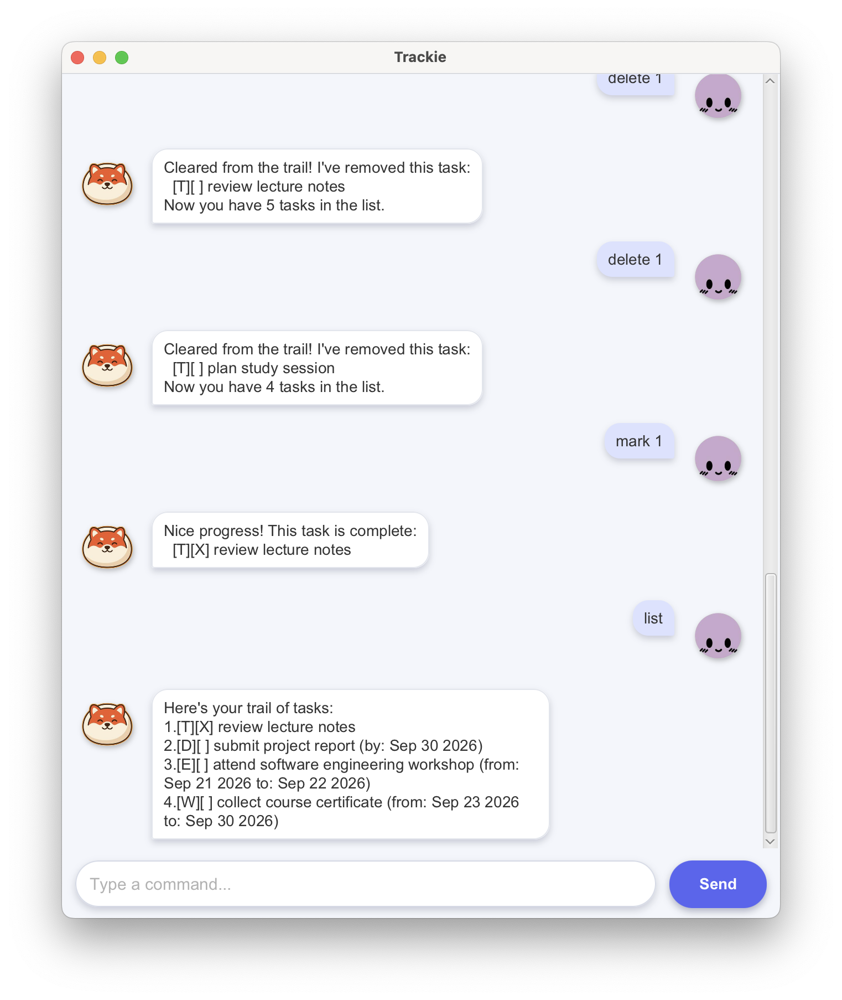

# Trackie User Guide

Trackie is a cheerful fox productivity coach that helps you record todos, deadlines, events, and tasks that can be completed within a date range. It saves every change automatically, so your tasks remain available the next time you open the application.



## Quick start

1. Ensure that Java 25 is installed.
2. Download `trackie.jar` from the latest GitHub release.
3. Open a terminal in the folder containing the JAR file.
4. Run `java -jar trackie.jar`.
5. Type a command in the input box and press **Enter** or click **Send**.

Dates must use the `yyyy-MM-dd` format, such as `2026-09-30`. Task descriptions cannot contain the `|` character because Trackie reserves it for saved data.

## Command summary

| Action | Command |
| --- | --- |
| Add a todo | `todo DESCRIPTION` |
| Add a deadline | `deadline DESCRIPTION /by DATE` |
| Add an event | `event DESCRIPTION /from START_DATE /to END_DATE` |
| Add a within-period task | `within DESCRIPTION /from START_DATE /to END_DATE` |
| List all tasks | `list` |
| Find tasks | `find KEYWORD` |
| Mark a task as done | `mark TASK_NUMBER` |
| Mark a task as not done | `unmark TASK_NUMBER` |
| Delete a task | `delete TASK_NUMBER` |
| Exit Trackie | `bye` |

## Adding a todo

Use `todo` for a task without an attached date.

```text
todo read Clean Code
```

## Adding a deadline

Use `deadline` for a task that must be completed by a particular date.

```text
deadline submit project report /by 2026-09-30
```

Trackie displays the saved deadline as:

```text
[D][ ] submit project report (by: Sep 30 2026)
```

## Adding an event

Use `event` for an activity with a start and end date.

```text
event attend software engineering workshop /from 2026-09-21 /to 2026-09-22
```

## Adding a task to do within a period

Use `within` for a task that may be completed at any time between two inclusive dates. The end date cannot be before the start date.

```text
within collect course certificate /from 2026-09-23 /to 2026-09-30
```

## Listing tasks

Enter `list` to display every task. Trackie numbers the tasks so that you can refer to them in `mark`, `unmark`, and `delete` commands.

```text
list
```

Example output:

```text
Here's your trail of tasks:
1.[T][ ] read Clean Code
2.[D][ ] submit project report (by: Sep 30 2026)
```

`T`, `D`, `E`, and `W` represent todos, deadlines, events, and within-period tasks. An `X` means that the task is completed; a blank space means that it is not completed.

## Finding tasks

Use `find` to display tasks whose descriptions contain the given keyword. The search is case-sensitive.

```text
find project
```

## Marking and unmarking tasks

Use the number shown by `list` to update a task's completion status.

```text
mark 2
unmark 2
```

## Deleting a task

Use `delete` followed by the task number. The remaining tasks are renumbered automatically.

```text
delete 2
```

## Exiting Trackie

Enter `bye` to close Trackie.

```text
bye
```

## Understanding errors

If a command is incomplete or invalid, Trackie explains the problem in a red-tinted response bubble. Correct the command using the formats above and try again; invalid commands do not close the application or change existing tasks.

## Data storage

Trackie stores tasks automatically in `data/trackie.txt`, relative to the folder from which it is launched. You do not need to save tasks manually. Avoid editing this file directly, as invalid content may prevent existing tasks from loading.
